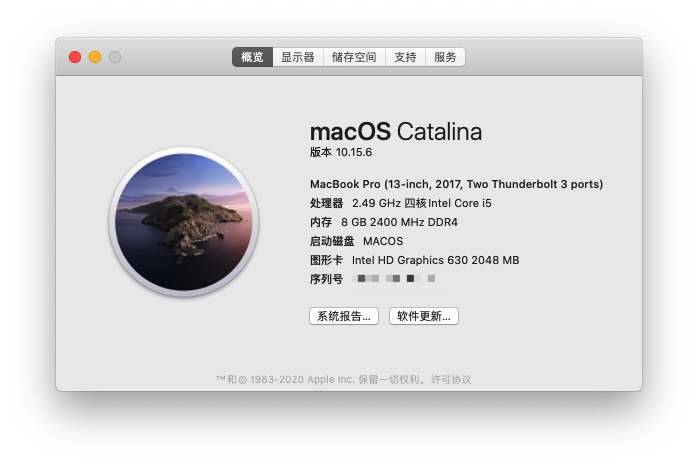
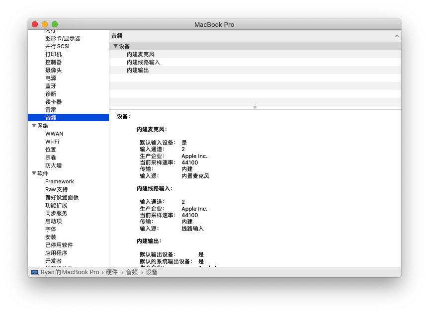
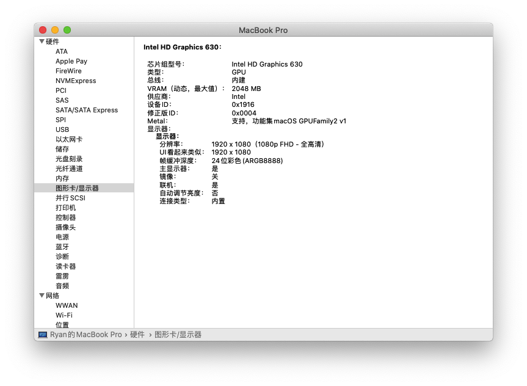
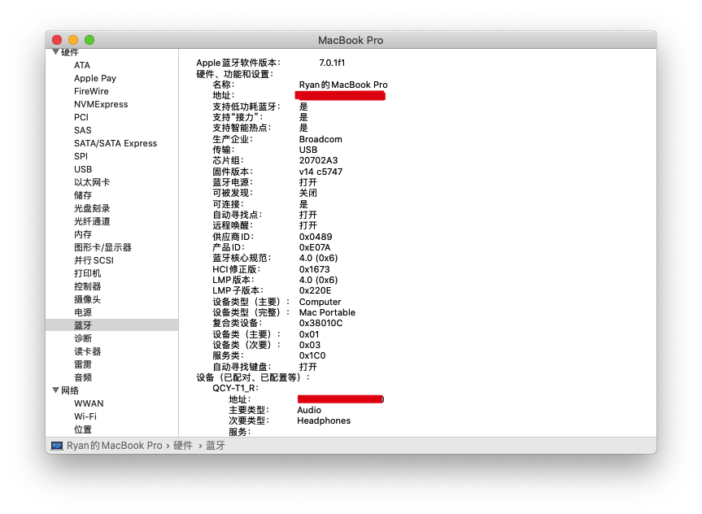

# Hackintosh_Of_Lenovo_R720

这个项目是我根据[Jonny-china/R720-15IKBN-Hackintosh-Clover](https://github.com/Jonny-china/R720-15IKBN-Hackintosh-Clover)这个项目，加上了USB定制，从而做到睡眠基本正常，USB定制请参考黑果小兵的[Hackintool(原Intel FB-Patcher)使用教程及插入姿势](https://blog.daliansky.net/Intel-FB-Patcher-tutorial-and-insertion-pose.html)。目前我只测试了**10.15.1**，最新的10.15.2还没有测试过，如果你想试的话，请更新CLOVERX64.efi到最新版本。

> 由于我使用的是dw1560网卡，没有使用该网卡的请自行删除/kext/Other/目录下的AirportBrcmFixup.kex、BrcmBluetoothInjector.kext、BrcmFirmwareData.kext、BrcmPatchRAM3.kext这四个与该网卡有关的驱动。

声卡注入ID是28，采用AppleALC.kext驱动。

蓝牙、Wi-Fi、核显正常。

