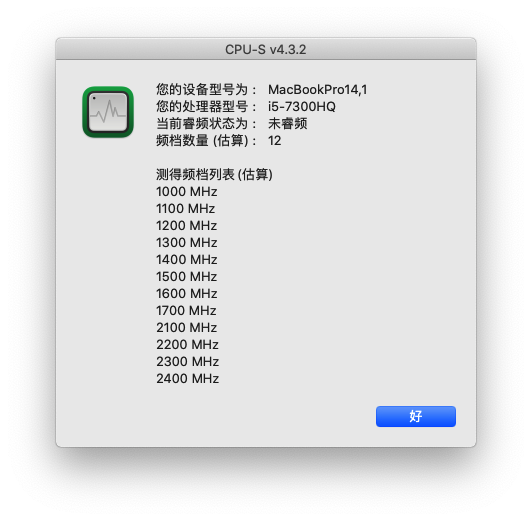

# Hackintosh_Of_Lenovo_R720

这个项目是我根据远景论坛上的项目修改而来，并非原创。本人加上了USB定制，从而做到睡眠基本正常，USB定制请参考黑果小兵的[Hackintool(原Intel FB-Patcher)使用教程及插入姿势](https://blog.daliansky.net/Intel-FB-Patcher-tutorial-and-insertion-pose.html)。目前我测试到**10.15.6**，~~最新的10.15.2还没有测试过，如果你想试的话，请更新CLOVERX64.efi到最新版本~~。本项目自带的序列号等信息已经被我更改了，请你自行更改成你需要的。

> 由于我使用的是dw1560网卡，没有使用该网卡的请自行删除/kext/Other/目录下的AirportBrcmFixup.kex、BrcmBluetoothInjector.kext、BrcmFirmwareData.kext、BrcmPatchRAM3.kext这四个与该网卡有关的驱动。

声卡注入ID是28，采用AppleALC.kext驱动。

蓝牙、Wi-Fi、核显正常。

变频我还没完善，默认的有12档。

核显驱动方法见：[黑苹果 | 4 步驱动 Intel 核显](https://blog.zuiyu1818.cn/posts/Hac_Intel_Graphics_simple.html) ，我使用的是0x16190000 ，至于为什么模拟的是上一代的CPU，主要是我试了用0x591B00，发现效果并没有这个好，而且日常使用也没有任何问题。

- 2020-1-27更新

  由于我的系统更新为10.15.2版本，因而更新clover为最新版本。不得不说的是，之前定制了USB驱动之后，睡眠正常了几天，但是下载睡眠功能又不正常了。出现的具体问题为睡眠唤醒后，鼠标的左键功能损坏，点击后与右键更能一致。

- 2020-1-27晚更新

  鼠标左键问题已经定位，在macOS中，ctrl+鼠标左键就是点击鼠标右键，因而你唤醒后按一下ctrl键就没有问题。

* 2020-05-12

  更新支持到10.15.4，只是我个人使用没什么问题，不保证都能使用

* 2020-08-06

  更新到了10.15.6，电量显示掉了，加了`ACPIBatteryManager.kext`这个驱动后，现在显示正常。
  
* 2021-01-08

  最近没有更新系统版本，但是对部分驱动更新了，现在运行10.15.6版本感觉不错，不插电耗电也比之前好多了。Opencore都出来这么久了，不是我不想换，而是我正在尝试当中，还有许多问题没有解决。